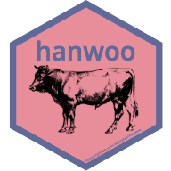

hanwoo 
=======================================================

A system for modeling the nutrient requirement of Hanwoo.

## Overview

한우의 영양 모델링을 위한 패키지입니다. 한국가축사양표준에 따른 모델링 정보를 제공합니다. 또한 공공데이터포털에서 XML 형태로 제공하는 한우의 기본정보, 도체정보 및 KPN 씨수소의 정보를 R로 importing 해올 수 있습니다.  

## Installation

```r
# install.packages("remotes")
remotes::install_github("adatalab/hanwoo")
```

## Usage
```r
library(hanwoo)
```

### 1. 영양소 요구량 설정

#### req\_\*

체중(bw; body weight)과 일당증체(dg; daily gain)에 따른 한우의 영양소 요구량을 데이터프레임 형식으로 제공합니다.

```r
req_steer(bw = 150, dg = 0.8) # 거세우의 영양소 요구량
req_bull(bw = 200, dg = 1.0) # 거세하지 않은 숫소의 영양소 요구량
```

#### steer\_\*

거세우의 개월령(month), 체고(height), 체장(length) 및 흉위(chest) 길이(cm)를 이용해 체중(kg)을 예측하는 모델입니다. `stats::predict` 함수를 이용하여 라이브러리에 내장 모델을 사용할 수 있습니다.

```r
predict(
  steer_h,
  data.frame(height = 100:140)
)

predict(
  steer_c,
  data.frame(chest = 125:230)
)

predict(
  steer_m,
  data.frame(month = 10:30)
)
```

### 2. 한우 기본 정보 및 도체성적 가져오기

본 함수들을 사용하기 위해서는 먼저 [공공데이터포털](data.go.kr)에서 회원가입 및 1) 쇠고기이력정보서비스와 2) 축산물통합이력정보제공에 대한 [활용 신청](https://www.data.go.kr/dataset/15000483/openapi.do)을 통해 API key를 발급받아야합니다.

#### hanwoo_key

**반드시 발급받은 API키를 등록해야** 정상적으로 한우의 기본 및 도체 정보를 가져올 수 있습니다.

```r
hanwoo_key(key = "YOUR_API_KEY_FROM_DATA.GO.KR")
```

#### hanwoo_info

특정 한우 개체번호를 입력하여 정보를 리스트 또는 데이터프레임 형태로 가져올 수 있습니다.

```r
hanwoo_info(cattle = "002083191603", type = "list")
hanwoo_info(cattle = "002083191603", type = "df")
```

여러마리의 데이터를 importing 해야 할 경우 다음과 같이 응용할 수 있습니다.

```r
code <- c("002070021011", "002065029272", "002062250044", "002063227367", "002066994812", "002067050894", "002064505530", "002070394423", "002064488463", "002064501114")

get_hanwoo <- function(x) {
  return(
    tryCatch(hanwoo_info(x, type = "df"), 
    error = function(e) NULL
    )
  )
} 

multiple_result <- lapply(code, FUN = get_hanwoo)
into_df <- plyr::ldply(multiple_result, data.frame)
```

#### hanwoo_bull

KPN 한우 씨수소의 유전정보를 importing 할 수 있습니다. API key를 요구하지 않습니다. 보증 및 후보씨수소 목록은 농협경제지주 [한우개량사업소](http://www.limc.co.kr/KpnInfo/KpnList.asp)에서 확인하실 수 있습니다.

```r
hanwoo_bull(KPN = 1080)
```

Notification
------------

개발중인 패키지입니다.

Getting helps
-------------

Email: ruminoreticulum@gmail.com
